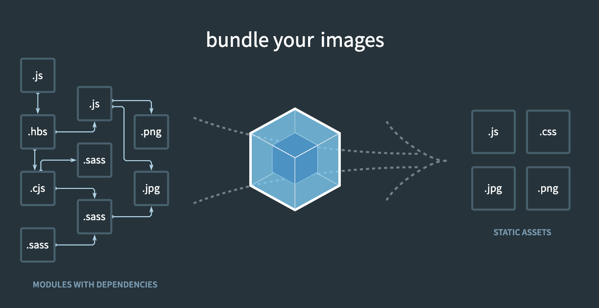
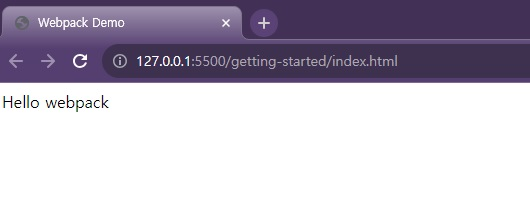
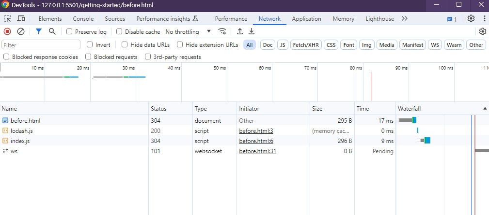
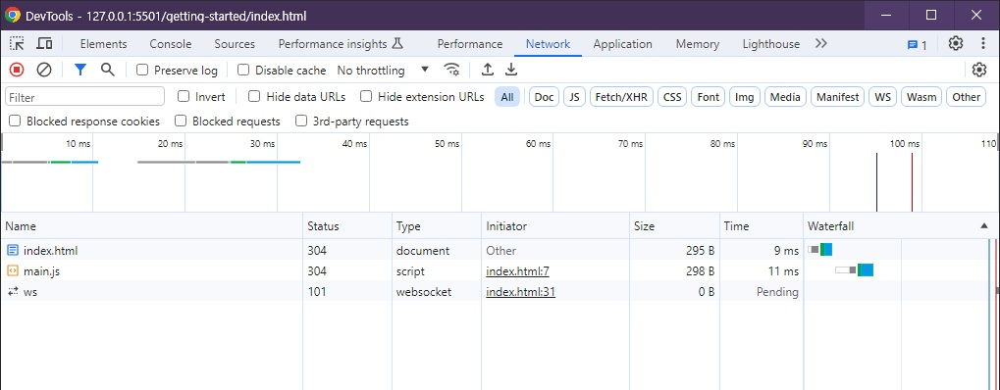

# 🐳 03. 웹팩 시작하기

## 🌏 03-01. 웹팩 시작하기

`웹팩`은 최슨 프런트엔드 프레임워크에서 가장 만힝 사용되는 **모듈 번들러**

필요에 따라 파일을 분리하거나 이미지 압축등 이미지의 최적화까지 진행해 줄 수 있다.

> **모듈 번들러**
>
> 웹 애플리케이션을 구성하는 자원(HTML, CSS, JS, Image등)을 모두 각각의 모듈로 보고, 이를 조합해 하나의 결과물을 만드는 도구.

즉, 파일들 간의 연관관계를 보고, 하나로 합쳐주는게 모듈 번들러. (합치는 작업을 번들링)<br/>



<br/><br/>

## 🌏 03-02. 웹팩 시작하기 튜토리얼 파트 1 - 웹팩 적용 전

(Webpack Handbook 1번부터 4번까지)

package.json을 만들고, webpack관련 라이브러리와 lodash를 설치.

**사용 명령어**

```shell
npm init -y

npm i webpack webpack-cli -D
npm i lodash
```

<br/>

그다음 `index.html` 생성.

```html
<html>
  <head>
    <title>Webpack Demo</title>
    <script src="https://unpkg.com/lodash@4.16.6"></script>
  </head>
  <body>
    <script src="src/index.js"></script>
  </body>
</html>
```

src폴더에 `index.js` 작성<br/>( Component를 body에 붙이는 코드 )

```javascript
function component() {
  var element = document.createElement('div');

  /* lodash is required for the next line to work */
  element.innerHTML = _.join(['Hello','webpack'], ' ');

  return element;
}

document.body.appendChild(component());
```



<br/>

### 📘 참고

* [Webpack 핸드북 - Getting Started](https://joshua1988.github.io/webpack-guide/getting-started.htm)

<br/><br/>

## 🌏 03-03. 웹팩 시작하기 튜토리얼 파트 2 - 웹팩 적용 후

(Webpack Handbook 5번부터 6번까지)

웹팩 빌드 및 빌드 결과물로 실행하기 위해 파일 내용 수정.

기존의 CDN으로 lodash를 불러오던 부분을 `index.js`에서 import 하고, build결과물인 `dist폴더`의 main.js를 실행하도록 수정.

```javascript
// index.js
import _ from 'lodash';

function component() {
  var element = document.createElement('div');

  /* lodash is required for the next line to work */
  element.innerHTML = _.join(['Hello','webpack'], ' ');

  return element;
}

document.body.appendChild(component());
```

```html
<html>
  <head>
    <title>Webpack Demo</title>
    <!-- <script src="https://unpkg.com/lodash@4.16.6"></script> -->
  </head>
  <body>
    <!-- <script src="src/index.js"></script> -->
    <script src="dist/main.js"></script>
  </body>
</html>
```

<br/>

package.json에서 **build명령어를 script에 추가.**

```json
"scripts": {
    "build": "webpack --mode=none",
  ...
}
```

<br/><br/>

## 🌏 03-04. 웹팩 시작하기 튜토리얼 파트 3 - mode 적용

OS에 따라(명령어 창의 기준) 명령어가 실행될 수도, 안될수도 있기 때문에 전부다 동일한 환경에서 실행될 수 있도록 실행.

`webpack`만 실행했을 때, Warning이 발생하는데, 이를 위해 mode를 설정해준다. (Webpack 4에 새로 생김.)

`mode`는 **development**, **production**, **none**까지 3가지 존재한다. (각 모드에따라 빌드되는 형태가 달라진다.)

<br/><br/>

## 🌏 03-05. 웹팩 시작하기 튜토리얼 파트 4 - 웹팩 설정 파일 적용

만약 dist의 main.js파일이 아니라, public폴더의 output.js로 수정하고싶다고 가정해보자.

```json
{
	"build": "webpack --mode=none --entry=src/index.js --output=public/output.js",
}
```

이런식으로 옵션을 계속 추가해 나가야 한다.

이렇게 매번 추가하는 것이 아니라, `웹팩 설정 파일`을 통해 관리할 수 있다.

```js
// webpack.config.js
module.exports = {
  mode: 'none',
  entry: './src/index.js',
  output:'./public/output.js'
}
```

이제 webpack 명령어만 실행하면, webpack.config.js의 설정을 들고와서 실행하게 된다.

<br/><br/>

## 🌏 03-06. 웹팩 시작하기 튜토리얼 파트 5 - 웹팩 설정 파일 설명

웹팩 설정파일을 다시보자.

```js
// webpack.config.js
// `webpack` command will pick up this config setup by default
var path = require('path');

module.exports = {
  mode: 'none',
  entry: './src/index.js',
  output: {
    filename: 'main.js',
    path: path.resolve(__dirname, 'dist')
  }
};
```

* path: Nodejs path라이브러리를 들고와 로딩해 path 변수에 담아둔다.
* output : webpack을 entry에있는 파일을 대상으로 돌려서, 결과물을 내는데, 결과물의 파일명과 경로를 설정해줌.


### 📘 참고

* [Node.js path API 문서](https://nodejs.org/api/path.html)


<br/><br/>

## 🌏 03-07. 웹팩 시작하기 튜토리얼 파트 6 - 튜토리얼 소스 분석

```javascript
// index.js
function component() {
  var element = document.createElement('div');

  /* lodash is required for the next line to work */
  element.innerHTML = _.join(['Hello','webpack'], ' ');

  return element;
}

document.body.appendChild(component());
```

기존 코드는 CDN으로 lodash를 가져와서 div태그를 만들어 innerHTML로 div tag에 넣어 리턴하였다.

<br/>

import 한 lodash는 es6의 모듈 문법이다.

```javascript
// es6
import _ from 'lodash';
// es5
// var _ = require('lodash');
```

<br/><br/>

## 🌏 03-08. 웹팩 시작하기 튜토리얼 파트 7 - 웹팩 변환 전후 결과 비교

Webpack적용 전 후의 코드를 살펴보자.

우선 실행화면에는 크게 차이가 보이지 않는다.

`개발자도구 - 네트워크 패널`에서 그 차이를 확인할 수 있다.

| before                                                       | after                                                       |
| ------------------------------------------------------------ | ----------------------------------------------------------- |
|  |  |

before의 경우 필요한 라이브러리를 요청하고, 필요한 파일을 요청 한다.

after의 경우, js파일을 하나로 합쳐서 해당 파일만 요청한 것을 볼 수 있다.

이런 요청의 개수가 많아질 수록 오래 걸리게 되고, 웹팩은 이런 리퀘스트들을 하나로 줄이는 이점을 가지게 된다.

<br/><br/>

## 🌏 03-09. 웹팩 시작하기 튜토리얼 파트 8 - 웹팩 빌드 결과 파일 분석

dist폴더의 main.js를 보자. (현재 webpack은 5번대라 작성된 내용의 결과물이 다를 수 있다. 강의는 4번대)

```javascript
/******/ (() => { // webpackBootstrap
/******/ 	var __webpack_modules__ = ([
/* 0 */,
/* 1 */
/***/ (function(module, exports, __webpack_require__) {
  ...
```

웹팩에서 웹 서비스를 구성하는 파일들, 모듈들을 하나의 번호로 관리를 하는 것을 알 수 있다.

<br/>

`IIFE(Immediately Invoked Function Expression)`라는 즉시 실행함수의 구조로 되어있는 것을 볼 수 있다. <br/>(다음강의에서 설명)

```javascript
(function(){
  ...
})()
```


### 📘 참고

* [MDN - 즉시 실행 함수](https://developer.mozilla.org/ko/docs/Glossary/IIFE)