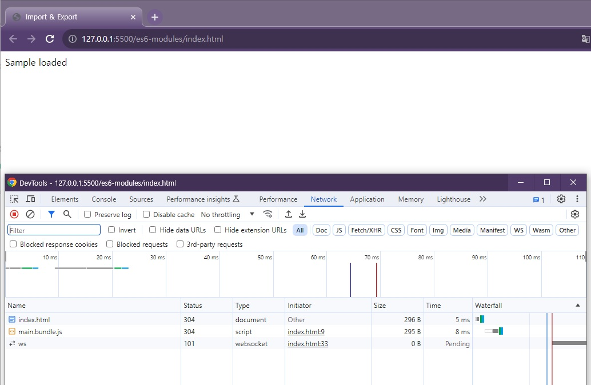
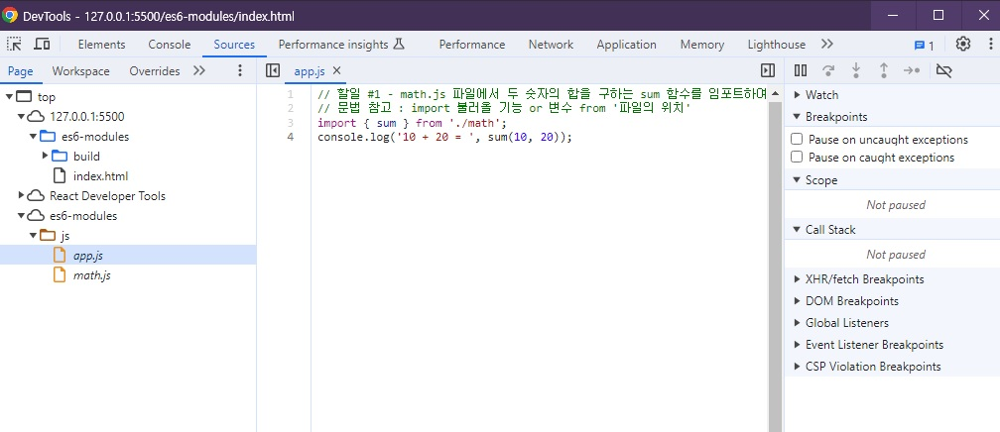

# 🐳 05. 바벨과 ES6 모듈 문법

## 🌏 05-01. 바벨 소개

ES6의 import, export를 간단히 알아보자.

`바벨`이란 자바스크립트의 최신 문법들을 최대한 많은 브라우저가 호환할 수 있게끔 변환해주는 도구.

```js
const sum = (a, b) => a + b;
```

```js
// 변환
var sum = function sum(a, b){
  return a + b;
}
```

<br/>

### 📘 참고

* [Babel 공식사이트](https://babeljs.io/)

<br/><br/>

## 🌏 05-02. ES6 Modules 문법

모듈기능을 위해선 `import`와 `export`키워드를 사용한다.

```js
export 변수, 함수
// ------------------------------------------------
import { 불러올 변수 or 함수 이름} from '파일경로'
```

**example**

```js
// math.js
export var pi = 3.14;
```

```js
// app.js
import { pi } from './math.js';
console.log(pi);
```

이전과 차이점은 Jaavascript 변수의 유효범위가 파일별로 구분이 된다. 모듈 차우너에서 관리가 수월해짐.

<br/><br/>

## 🌏 05-03. ES6 Modules 실습

(강의는 package.json을 가져와서 install하지만, npm init으로 package.json생성 후 라이브러리를 설치하여, 버전이 차이가 있음.)

```shell
 npm i -D @babel/core @babel/preset-env babel-loader webpack webpack-cli
```

<br/>

**index.html과 js파일 작성**

`math.js`에서 sum함수를 `export`하고, `app.js`에서 `import`

```html
<html>
<head>
	<meta charset="UTF-8">
	<meta name="viewport" content="width=device-width, initial-scale=1.0">
	<meta http-equiv="X-UA-Compatible" content="ie=edge">
	<title>Import & Export</title>
</head>
<body>
	Sample loaded
	<script src="build/main.bundle.js"></script>
</body>
</html>
```

```js
// app.js
// 할일 #1 - math.js 파일에서 두 숫자의 합을 구하는 sum 함수를 임포트하여 콘솔에 찍어보세요.
// 문법 참고 : import 불러올 기능 or 변수 from '파일의 위치'
import { sum } from './math';
console.log('10 + 20 = ', sum(10, 20));
```

```js
// math.js
// sum() 함수 구현 후 export 하세요.
export function sum(a, b) {
  return a + b;
}
```

<br/><br/>

## 🌏 05-04. ES6 Modules 실습 결과 확인

package.json 의 script에 build를 추가.

```json
{
  ...
   "scripts": {
    "build": "webpack",
    "test": "echo \"Error: no test specified\" && exit 1"
  },
}
```

`webpack.config.js` 작성

```js
var path = require('path');

module.exports = {
	mode: 'production',
	entry: './js/app.js',
	output: {
			path: path.resolve(__dirname, 'build'),
			filename: 'main.bundle.js'
	},
	module: {
		rules: [{
			test: /\.m?js$/,
			exclude: /(node_modules|bower_components)/,
			use: {
				loader: 'babel-loader',
				options: {
					presets: ['@babel/preset-env']
				}
			}
		}]
	},
	stats: {
			colors: true
	},
	devtool: 'source-map'
};
```

<br/>

build하게되면 `build`폴더에 `main.bundle.js`까지 나온것을 확인할 수 있다.<br/>(config파일의 output부분에 작성한 내용임을 잊지말자.)

**결과**



<br/><br/>

## 🌏 05-05.  ES6 Modules 빌드 결과물 분석 - sourcemap

webpack의 `sourcemap`이라는 기능을 알아보자.

console의 내용 우측에 `app.js:4`를 클릭하게 되면 아래와 같이 결과가 나온다.



근데, 위에 Network패널에서 우리가 가져온건 main.bundle.js하난데 어떻게 **build하기 전의 파일로 연결이 되는걸까?**

<br/>웹팩 빌드 후(production)에 main.bundle.js내용을 보면 알아보기 힘들게  난독화 되어있다. 만약 console.log에서 이 난독화된 부분을 가리키게되면, build전의 코드와 대조해야하는 경우가 발생하고, 개발 생산성에 엄청난 차질이 있기 때문에 기본적으로 웹페이지에서 제공하는 기능은 빌드했다 하더라도, 연결은 빌드전의 파일로 연결해주는 것이 `sourcemap`이다.