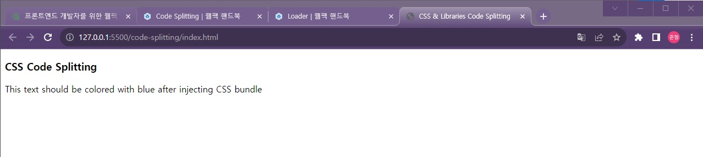

# 🐳 06. 웹팩의 주요 속성 4가지

## 🌏 06-01. 웹팩 주요 속성 소개 (entry, output, loader)

주요 속성으로  `entry`, `output`, `loader`, `plugin`이 있다.

이전에 작성했던 속성들을 잠깐 보자.

```js
var path = require('path');

module.exports = {
	mode: 'production',
	entry: './js/app.js',
	output: {
			path: path.resolve(__dirname, 'build'),
			filename: 'main.bundle.js'
	},
	module: {
		rules: [{
			test: /\.m?js$/,
			exclude: /(node_modules|bower_components)/,
			use: {
				loader: 'babel-loader',
				options: {
					presets: ['@babel/preset-env']
				}
			}
		}]
	},
	stats: {
			colors: true
	},
	devtool: 'source-map'
};

```

* `entry`는 대상이 되는 폴더를 정의 해놓는 속성
* `output`은 웹팩으로 변환하고나서 나온 결과물에 대한 정보를 정의하는 속성
*  `module`은 entry에서 output으로 변환할 때 중간에 개입하는 것

주요 속성들에 대해 하나씩 알아보자.

<br/>

### 👉 Entry

`entry`는 웹팩에서 웹 자원들을 변환하기 위해서 필요한 **최초 진입점**이자 자바스크립트 파일 경로

```js
module.exports={
  entry: './src/index.js'
}
```

#### 🔸 어떤 내용이 들어가야하나?

웹페이지 전반적인 구조와 내용이 담겨있어야 한다. <br/>웹팩이 해당 파일을 가지고 모듈들의 연관관계를 이해하고 분석하기 때문에 애플리케이션을 동작시킬 수 있는 내용이 있어야 한다.

> 디펜던시 그래프 (Dependency Graph)
>
> 모듈간의 의존 관계가 생기는 구조.

<br/>


### 👉 Output

`output`은 웹팩을 돌리고 난 결과물의 파일 경로를 의미.

```js
// webpack.config.js
module.exports = {
  output: {
    filename: 'bundle.js'
  }
}
```

#### 🔸 Output 속성 옵션 형태

최소한 `filename`은 지정해주어야 하며, `path`를 함께 정의함.

```js
// webpack.config.js
var path = require('path');

module.exports = {
  output: {
    filename: 'bundle.js',
    path: path.resolve(__dirname, './dist')
  }
}
```

#### 🔸 파일 이름 옵션

`filename`속성에 여러 옵션이 들어갈 수 있다.

* 결과 파일 이름에 `entry`속성을 포함하는 옵션 : `filename: '[name].bundle.js'`
* 결과 파일 이름에 웹팩 내부적으로 사용하는 모듈 ID를 포함하는 옵션 : `filename: '[id].bundle.js'`
* 매 빌드시 마다 고유 해시 값을 붙이는 옵션 : `filename: '[name].[hash].bundle.js'`
* 웹팩의 각 모듈 내용을 기준으로 생성된 해시 값을 붙이는 옵션 : `filename: '[chunkhash].bundle.js'`

❗ 위처럼 사용하면, 빌드 할때마다 고유 어떤 값들을 붙여주게 된다. 그래서 항상 내부의 **파일 내용과 관계없이 브라우저 캐싱 때문에 같은 파일을 화면에 뿌려주기 때문에** 강제 새로고침해주어야 한다.<br/>그래서 내용 변환시에는 chunkhash같은 걸로 어떤 고유값, 구분자를 줘서 파일이 변환이 됐다는 것을 인식시키면서 사용자가 강제 새로고침하지 않도록 할 수 있다.

<br/>

### 

### 👉 Loader

웹팩이 웹 애플리케이션을 해석할 때 자바스크립트 파일이 아닌 웹 자원(HTML, CSS, Images, Font등)들을 변환할 수 있도록 도와주는 속성

```js
// webpack.config.js
module.exports = {
  module: {
    rules: []
  }
}
```

(loader에 자세한부분은 실습을 통해 알아보자)

<br/>

###  📘 참고

* [Webpack Handbook - 웹팩의 4가지 주요 속성](https://joshua1988.github.io/webpack-guide/concepts/overview.html)

<br/><br/>

## 🌏 06-02. 주요 속성을 이해하기 위한 두 번쨰 튜토리얼 실습

Code Splitting이라는 실습을 두번째 실습으로 진행해보자.

프로젝트 생성

1. package.json 생성 : `npm init -y`

2. 라이브러리 설치 : `npm i webpack webpack-cli css-loader style-loader mini-css-extract-plugin -D`

3. index.html 작성

   * ```html
     <!DOCTYPE html>
     <html>
       <head>
         <meta charset="utf-8">
         <title>CSS & Libraries Code Splitting</title>
       </head>
       <body>
         <header>
           <h3>CSS Code Splitting</h3>
         </header>
         <div>
           <!-- 웹팩 빌드 결과물이 잘 로딩되면 아래 p 태그의 텍스트 색깔이 파란색으로 표시됨 -->
           <p>
             This text should be colored with blue after injecting CSS bundle
           </p>
         </div>
         <!-- 웹팩의 빌드 결과물을 로딩하는 스크립트 -->
         <script src="./dist/bundle.js"></script>
       </body>
     </html>
     ```

4. 루트 레벨에 base.css 추가

   * ```css
     p {
       color : blue;
     }
     ```

5. 루트 폴더에 index.js생성

   * ```js
     import './base.css';
     ```

6. 루트 레벨에 웹팩 설정파일 추가.

   * ```js
     var path = require('path');
     
     module.exports = {
       mode: 'none',
       entry: './index.js',
       output: {
         filename: 'bundle.js',
         path: path.resolve(__dirname, 'dist')
       },
       module: {
         rules: [
           {
             test: /\.css$/,
             use: ['style-loader', 'css-loader']
           }
         ]
       },
     }
     ```

7. CSS파일을 분리하기 위해 `MiniCssExtractPlugin` 추가

   ```js
   {
     ...
     plugins: [
       new MiniCssExtracctPlugin()
     ]
   }
   ```

작성 후 `npm run build`까지 실행

<br/>

### 📘 참고

* [Webpack Handbook - 튜토리얼 문서](https://joshua1988.github.io/webpack-guide/tutorials/code-splitting.html)

<br/><br/>

## 🌏 06-03. 두 번째  튜토리얼 - 웹팩  결과 로그 분석

webpack 로그를 보는 방법에 대해서 먼저 알아보자.<br/> (version이 영상과 현재 다르기 때문에 로그에 차이가 있다.)

```shell
> code-splitting@1.0.0 build
> webpack

asset bundle.js 17 KiB [emitted] (name: main)
runtime modules 972 bytes 5 modules
cacheable modules 9.71 KiB
  modules by path ./node_modules/ 8.15 KiB
    modules by path ./node_modules/style-loader/dist/runtime/*.js 5.84 KiB
      ./node_modules/style-loader/dist/runtime/injectStylesIntoStyleTag.js 2.42 KiB [built] [code generated]
      ./node_modules/style-loader/dist/runtime/styleDomAPI.js 1.5 KiB [built] [code generated]
      ./node_modules/style-loader/dist/runtime/insertBySelector.js 1000 bytes [built] [code generated]      
      + 3 modules
    modules by path ./node_modules/css-loader/dist/runtime/*.js 2.31 KiB
      ./node_modules/css-loader/dist/runtime/noSourceMaps.js 64 bytes [built] [code generated]
      ./node_modules/css-loader/dist/runtime/api.js 2.25 KiB [built] [code generated]
  modules by path ./*.css 1.54 KiB
    ./base.css 1.1 KiB [built] [code generated]
    ./node_modules/css-loader/dist/cjs.js!./base.css 444 bytes [built] [code generated]
  ./index.js 20 bytes [built] [code generated]
webpack 5.89.0 compiled successfully in 858 ms
```

* line 2 : npm run build를 하게되면 script 에서 작성한 `webpack` 명령어가 실행되는 걸 볼 수 있다. 
* line4 ~ 19 : asset부터 시작해, 차례차례 build되는 것을 볼 수 있다.

<br/><br/>

## 🌏 06-04. 두 번째  튜토리얼 - 브라우저에서 빌드 결과물 확인

`index.html`을 live Server로 실행.

현재 p태그에 blue color가 적용된 걸 볼 수 있다. <br/>개발자 도구의 구조와 우리가 작성한 코드의 구조가 다른것을 확인할 수 있다.

```html
<!--개발자 도구-->
<html>
  <head>
    <meta ...>
    <title> ... </title>
    <style> ... </style>
  </head>
</html>
```

```html
<!--index.html-->
<head>
  <meta charset="utf-8">
  <title>CSS & Libraries Code Splitting</title>
</head>
```

<br/><br/>

## 🌏 06-05. 두 번째  튜토리얼 - 웹팩  빌드 결과 파일 분석

빌드한 결과물인 `bundle.js`를 살펴보자.

```js
// bundle.js
...
___CSS_LOADER_EXPORT___.push([module.id, `p {
  color : blue;
}`, ""]);
// Exports
/* harmony default export */ const __WEBPACK_DEFAULT_EXPORT__ = (___CSS_LOADER_EXPORT___);
...
```

bundle.js에 style로 작성한 내용이 문자열로 들어와 있는 것을 볼 수 있다.

이게 바로 loader다.<br/>Javascript가 아닌 파일에 대해서 웹팩 안으로 변환할 수 있게 뭔가 적용해주는 도구가 바로 `loader`이다.

<br/><br/>

## 🌏 06-06. 두 번째  튜토리얼 - 웹팩  설정 파일 분석

작성했던 `webpack.config.js`파일을 다시 살펴보자.

```js
var path = require('path');
var MiniCssExtractPlugin = require("mini-css-extract-plugin");

module.exports = {
  mode: 'none', // production, development, none
  entry: './index.js', 
  output: {
    filename: 'bundle.js',
    path: path.resolve(__dirname, 'dist')
  },
  module: {
    rules: [
      {
        test: /\.css$/,
        use: ['style-loader', 'css-loader']
      },
    ]
  },
  // plugins: [
  //   new MiniCssExtractPlugin()
  // ],
}
```

module이란 속성에 객체를 두고, rules배열아네 loader들을 하나씩 추가할 수 있다.

작성 내용을 살펴보면 `.css`로 된 파일들에 대해 `style-loader`와 `css-loader`를 적용했다고 보면 된다.

만약 babel을 추가로 적용 하겠다하면, 아래처럼 작성할 수 있다.

```js
{
  ...
  module: {
    rules: [
      {
        test: /\.css$/,
        use: ['style-loader', 'css-loader']
      },
      {
        test: /\.js/,
        use: ['babel-loader']
      },
    ]
  },
}
```

<br/><br/>

## 🌏 06-07. 두 번째  튜토리얼 - 로더가 없는 경우의 에러 확인과 css로더 적용

로더의 특징과 순서에 대해 알아보자.

차이를 알아보기 위해 module속성을 주석처리하고, 빌드를 해보자.

```shell
asset bundle.js 3.46 KiB [emitted] (name: main)
runtime modules 937 bytes 4 modules
cacheable modules 41 bytes
  ./index.js 20 bytes [built] [code generated]
  ./base.css 21 bytes [built] [code generated] [1 error]

ERROR in ./base.css 1:2
Module parse failed: Unexpected token (1:2)
You may need an appropriate loader to handle this file type, currently no loaders are configured to process this file. See https://webpack.js.org/concepts#loaders
> p {
|   color : blue;
| }
 @ ./index.js 1:0-20

webpack 5.89.0 compiled with 1 error in 80 ms
```

base.css에서 Error가 발생이 됐고, css파일을 알 수 없기 때문에 적절한 loader설정을 해주어야 한다고, 알려주고있다.

<br/>

`css-loader`만 추가해서 build해보자. Errror는 발생하지 않았지만, 결과를 확인해보면, p tag에 색이 적용되지 않은 것을 볼 수 있다.



<br/><br/>

## 🌏 06-08. 두 번째  튜토리얼 - 웹팩 로더 적용 순서와 style-loader

이전 시간에서 `css-loader`로 css파일이 웹팩에서 인식할 수 있게 되었다는 것을 알 수 있었고, 앞으로도 파일로더나 다른 로더들을 이용해 **웹팩에서 인식할 수 없는 js가 아닌 유형의 파일들에 대해서 로더를 적용하면 되겠다**라는 것을 배웠다.

`style-loader`를 `css-loader`다음에 추가해보자.

```js
{
  ...
   module: {
    rules: [
      {
        test: /\.css$/,
        use: ['css-loader','style-loader']
      },
    ]
  },
}
```

```shell
ERROR in ./base.css
Module build failed (from ./node_modules/css-loader/dist/cjs.js):

SyntaxError

(2:7) D:\Vue\Inflearn-Webpack\practice\PracticeWebpack\code-splitting\base.css Unknown word

  1 | 
> 2 |       import API from "!./node_modules/style-loader/dist/runtime/injectStylesIntoStyleTag.js";
    |       ^
  3 |       import domAPI from "!./node_modules/style-loader/dist/runtime/styleDomAPI.js";
  4 |       import insertFn from "!./node_modules/style-loader/dist/runtime/insertBySelector.js";
 @ ./index.js 1:0-20

webpack 5.89.0 compiled with 1 error in 304 ms
```

`style-loader`와 `css-loader`의 순서가 중요한 것을 알 수 있다.

**❗ 항상 로더는 오른쪽에서 왼쪽 순서로 적용된다.**

sass의 경우 가장 끝에 sass-loader를 붙이고, `sass-laoder` -> `css-loaer` -> `style-loadr` 순으로 읽혀야 한다.

<br/><br/>

## 🌏 06-09. 두 번째  튜토리얼 - 플러그인 적용 및 분석

`MiniCssExtractPlugin` 플러그인을 추가해보자.

```js
...
var MiniCssExtractPlugin = require("mini-css-extract-plugin");

module.exports = {
  ...
  module: {
    rules: [
      // {
      //   test: /\.css$/,
      //   use: ['style-loader', 'css-loader']
      // },
      {
        test: /\.css$/,
        use: [{loader: MiniCssExtractPlugin.loader}, 'css-loader']
      },
    ]
  },
  plugins: [
    new MiniCssExtractPlugin()
  ],
}
```

`npm run build`를 하게 되면, `bundle.js`와 `main.css`파일까지 나온 것을 확인할 수 있다.

<br/><br/>

## 🌏 06-10. 두 번째  튜토리얼 - 플러그인 적용 결과 확인

결과를 보면 p tag에 색상이 적용되지 않은 것을 볼 수 있다.

css를 의도적으로 분리했기 때문에 index.html에 새로 생성된 css를 적용.

```html
<link rel="stylesheet" href="./dist/main.css">
```

`plugin`은 결과물에 대한 정보를 바꾸고, 변형해서 우리에게 제공해줄 수 있다는 것을 알 수 있다.

<br/><br/>

## 🌏 06-11. plugin

`plugin`은 웹팩의 기본적인 동작에 추가적인 기능을 제공하는 속성.

로더랑 비교하면, `로더`는 **파일을 해석하고 변환하는 과정에 관여**하지만, `플러그인`은 **결과물의 형태를 바꾸는 역할.**

배열안에 생성자 함수로 생성한 객체 인스턴스만 주입할 수 있다.

<br/>

마지막으로 참고의 링크문서를 읽으며, 강의내용들을 정리해보자.

### 📘 참고

* [Webpack Handbook - 주요 속성 리뷰 문서](https://joshua1988.github.io/webpack-guide/concepts/wrapup.html)

<br/><br/>

## 🌏 06-12. 강좌 이후에 웹팩 설정 파일 설정 및 변경 시 참고할 자료

이외에도 많은 loaders와 plugins들이 있다. <br/>이는 webpack공식문서에 문서화가 되있기 때문에 이를 찾아서 적용해보면된다.


### 📘 참고

* [Webpack 공식문서 - loaders](https://webpack.js.org/loaders/)
* [Webpack 공식문서 - plugins](https://webpack.js.org/plugins/)


